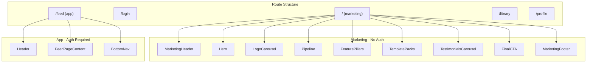

# FEEDR Landing Page Enhancement

## Current State

- **Tailwind**: Yes, configured with FEEDR brand tokens (`feedr-bg`, `feedr-teal`, `feedr-cyan`, etc.) in [tailwind.config.ts](tailwind.config.ts)
- **shadcn**: No `components/ui` folder; globals.css has shadcn-compat HSL vars but no shadcn components
- **Font**: Inter via `next/font` in [app/layout.tsx](app/layout.tsx)
- **Routing conflict**: Both `app/page.tsx` and `app/(main)/page.tsx` would resolve to `/`. Moving the feed to `/feed` is required before adding marketing at `/`.

## Architecture




## Phase 1: Routing Restructure

Because `/` cannot serve both marketing and the feed, move the feed first.


| Step | Action                                                                                                                                                                                                                                                                                                          |
| ---- | --------------------------------------------------------------------------------------------------------------------------------------------------------------------------------------------------------------------------------------------------------------------------------------------------------------- |
| 1.1  | Move [app/(main)/page.tsx](app/(main)/page.tsx) content to new `app/(main)/feed/page.tsx`                                                                                                                                                                                                                       |
| 1.2  | Delete `app/(main)/page.tsx`                                                                                                                                                                                                                                                                                    |
| 1.3  | Update `BottomNav` Feed href: `"/"` → `"/feed"` in [components/nav/BottomNav.tsx](components/nav/BottomNav.tsx)                                                                                                                                                                                                 |
| 1.4  | Update post-login redirects: `router.push("/")` → `router.push("/feed")` in [app/(auth)/login/page.tsx](app/(auth)/login/page.tsx) (lines 74, 91)                                                                                                                                                               |
| 1.5  | Update [app/auth/confirmed/page.tsx](app/auth/confirmed/page.tsx): `router.push("/")` → `router.push("/feed")` (lines 17, 98)                                                                                                                                                                                   |
| 1.6  | Update [app/(main)/library/page.tsx](app/(main)/library/page.tsx): `href="/"` → `href="/feed"` (lines 231, 345)                                                                                                                                                                                                 |
| 1.7  | Update feed completion link in [app/(main)/page.tsx](app/(main)/page.tsx) — wait, this file moves to feed — so the "View Library" link in FeedPageContent stays as `/library?tab=...`; the "Create another" flow stays local. The Library "Create" button and back chevron link to feed, so they become `/feed` |


## Phase 2: Dependencies and Global Setup

**2.1 Install deps**

```bash
npm i framer-motion embla-carousel-react
```

**2.2 Fonts in [app/layout.tsx**](app/layout.tsx)

- Add a display font (e.g. `Space_Grotesk` or `Geist`) for headlines
- Keep Inter as UI font
- Apply via `className` on `<html>` with CSS variables

**2.3 [app/globals.css](app/globals.css) additions**

- `html { scroll-behavior: smooth; }`
- Landing section utilities: `.section` (py-16–24), `.container` (max-w-6xl mx-auto px-4)
- Landing background: `.landing-bg` with subtle grid + radial glow blobs (teal/cyan)
- Reuse existing `--feedr-*` tokens

## Phase 3: Motion Utilities

Create `components/motion/`:


| File                  | Purpose                                                                                        |
| --------------------- | ---------------------------------------------------------------------------------------------- |
| `AnimateIn.tsx`       | Wrapper with `whileInView`, `viewport={{ once: true, amount: 0.2 }}`, fade+slide+blur variants |
| `StaggerChildren.tsx` | Container with `staggerChildren`; child items use shared `fadeUp` variant                      |
| `AnimatedCounter.tsx` | Counts from `from` to `to` on view with spring; optional `suffix`                              |


## Phase 4: Marketing Components

Create `components/landing/`:


| Component                  | Contents                                                                                                                                                                                                                   |
| -------------------------- | -------------------------------------------------------------------------------------------------------------------------------------------------------------------------------------------------------------------------- |
| `Hero.tsx`                 | Headline "Generate. Scroll. Pick winners."; subhead from spec; dual CTA (Start Feeding → `/login`, Watch pipeline → `#pipeline`); "No prompt engineering" microcopy; right: animated tray mock (Framer) with glow parallax |
| `LogoCarousel.tsx`         | "Trusted by / Built for" row; desktop: static; mobile: Embla with snap + gradient fades                                                                                                                                    |
| `Pipeline.tsx`             | Left: 6-step stepper (Type idea → Pick vibe → FEED → Tray → Pick winners/kill → Ship); right: mini mock cards per step; step changes crossfade; "What FEEDR automates" mini list                                           |
| `FeaturePillars.tsx`       | 3 pillars: Consistency, Speed, Performance; use `AnimateIn`                                                                                                                                                                |
| `TemplatePacks.tsx`        | Hook Packs grid (skincare, haircare, fitness, SaaS, local); each card: best for, avg winner rate, sample tray                                                                                                              |
| `TestimonialsCarousel.tsx` | Embla carousel; quote cards with avatar, name, role, platform icon, metric callout                                                                                                                                         |
| `FinalCTA.tsx`             | "Start Feeding" + "Book a pipeline demo"; trust microcopy ("No credit card", "Cancel anytime")                                                                                                                             |


## Phase 5: Header and Footer

**5.1 [components/nav/MarketingHeader.tsx**](components/nav/MarketingHeader.tsx) (new)

- Sticky, `z-50`
- Scroll effect: `scrollY > 8` → backdrop blur, border, shadow
- Left: Logo (Link to `/`) + anchor links (Pipeline, Templates, Pricing → `#pipeline`, `#templates`, `#pricing`)
- Right: Login (secondary) + Start Feeding (primary → `/login`)

**5.2 [components/footer/MarketingFooter.tsx**](components/footer/MarketingFooter.tsx) (new)

- 4 columns: Product | Company | Resources | Legal
- Product: Pipeline, Templates, Providers, Pricing
- Company: About, Contact
- Resources: Docs, Status, Changelog (placeholder links)
- Legal: Terms, Privacy
- Bottom: © + "Made for creators & agencies"

## Phase 6: Marketing Page

**6.1 Create [app/page.tsx**](app/page.tsx)

- No auth
- Composition:

```tsx
<MarketingHeader />
<main>
  <Hero />
  <LogoCarousel />
  <section id="pipeline"><Pipeline /></section>
  <FeaturePillars />
  <section id="templates"><TemplatePacks /></section>
  <TestimonialsCarousel />
  <FinalCTA />
</main>
<MarketingFooter />
```

## Phase 7: Login Tweaks

- In [app/(auth)/login/page.tsx](app/(auth)/login/page.tsx), add "Back to home" link (→ `/`) above or below the form

## Phase 8: Tailwind Config

- Ensure [tailwind.config.ts](tailwind.config.ts) `content` includes `./components/motion/**/*.{ts,tsx}` and `./components/landing/**/*.{ts,tsx}` (already covered by `./components/**/*` and `./app/**/*`)

## File Map (New Files)

```
app/
  page.tsx                    # NEW: marketing landing

app/(main)/
  feed/
    page.tsx                  # NEW: moved from (main)/page.tsx

components/
  motion/
    AnimateIn.tsx             # NEW
    StaggerChildren.tsx       # NEW
    AnimatedCounter.tsx        # NEW
  nav/
    MarketingHeader.tsx        # NEW
  footer/
    MarketingFooter.tsx        # NEW
  landing/
    Hero.tsx                  # NEW
    LogoCarousel.tsx           # NEW
    Pipeline.tsx               # NEW
    FeaturePillars.tsx         # NEW
    TemplatePacks.tsx          # NEW
    TestimonialsCarousel.tsx   # NEW
    FinalCTA.tsx               # NEW
```

## Key Copy (from spec)

- Hero: "Generate. Scroll. Pick winners."
- Subhead: "FEEDR turns one idea into a scrollable batch of UGC variants, then helps you quickly promote what wins."
- Pipeline: "Not a video tool. A testing engine." / "Batch > tray > decision > repeat."

## Apply Order

1. Install deps
2. Routing: move feed to `/feed`, delete old page, update all `/` → `/feed` links
3. Fonts + globals.css
4. Motion utilities
5. MarketingHeader + MarketingFooter
6. Landing components (Hero first, then Pipeline, then carousels, pillars, templates, final CTA)
7. app/page.tsx
8. Login "Back to home" link

